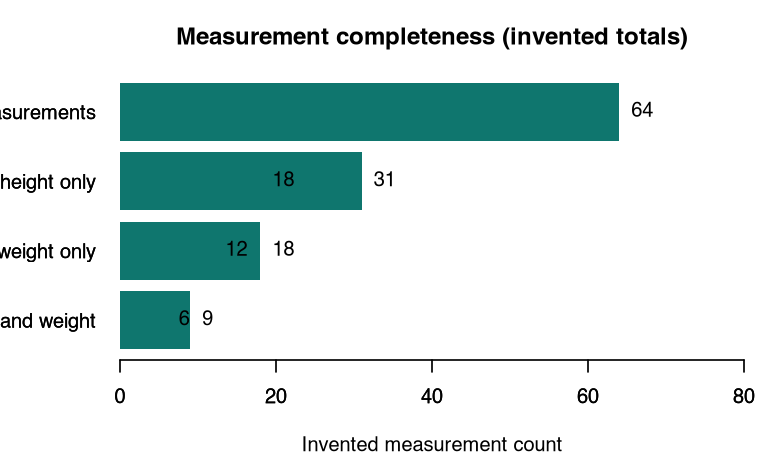
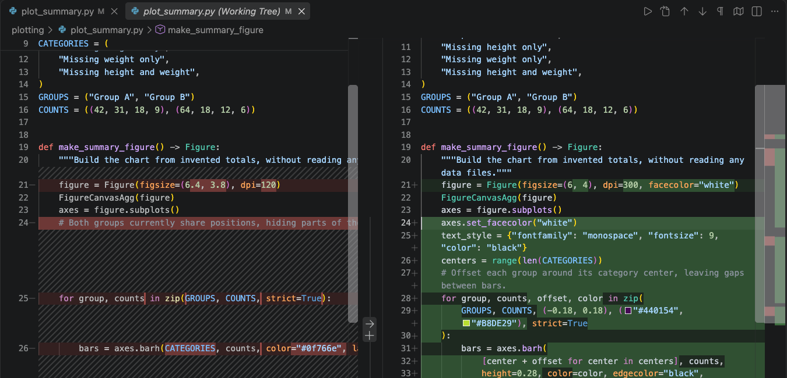
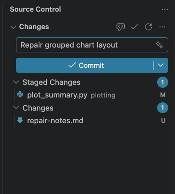

## Repair a plot in VS Code + GitHub Copilot

Today we will repair a plotting function in an existing repository.

1. **Ask** about the source.
2. **Plan** the repair, then let **Agent** implement it.
3. Inspect check results and compare the plots.
4. Review the color-coded diff, commit locally, and hand off.

::: {.notes}
Use docs/lab_meeting/45min_runbook.md. Participants complete the VS Code + Copilot setup for Python or R before the presentation. Demonstrate the actual Local Ask/Plan/Agent selector, and leave time for Source Control review and a local commit. The same path works at home. The exercise uses invented category totals embedded in source code. Agents work with code, the aggregate image, and test results; no participant records are needed.
:::

## Choose your path once

[Python path](https://fritschelab.org/practical-genai-agentic-coding-guide/docs/paths/python/) · [R path](https://fritschelab.org/practical-genai-agentic-coding-guide/docs/paths/r/)

Use the [VS Code setup](https://fritschelab.org/practical-genai-agentic-coding-guide/docs/setup/vscode-copilot.html) to clone the example through **Source Control**. Keep the guide open alongside it.

Both paths plot the same four invented category totals for **Group A** and **Group B**.

The starting image is created successfully, but the groups overlap and long labels are clipped.

::: {.notes}
Open the selected path. Copilot runs setup, rendering, and verification commands while participants inspect output. Review and commit through Source Control. No typed shell commands are needed in the main path. Python uses Matplotlib; R uses base graphics. No model API is needed to render the plot.
:::

## Find the four Chat controls

:::: {.columns}
::: {.column width="53%"}
{width=620px fig-alt="Open Copilot selector with Agent, Ask, and Plan; Auto, Local, and Default permissions are separate controls."}

VS Code 1.137.0 · macOS · September 11, 2026
:::
::: {.column width="47%"}
- **Local:** this workspace.
- **Ask → Plan → Agent:** the role.
- **Auto:** model selection.
- **Default permissions:** inspect requests; documentation calls this Manual permissions.
:::
::::

Open **Chat → Open Chat**. Select the role before pasting the lesson prompt.

::: {.notes}
Open the actual selector so learners see Ask, Plan, and Agent. The captured VS Code 1.137.0 client shows Default permissions; current documentation calls it Manual permissions. Student/Free plans currently use Auto selection only. Manual permissions retains saved tool and terminal approvals. Do not promise a prompt for every command. Claude Code users select Plan or Manual in the native extension's permission selector instead.
:::

## Approval is a decision

:::: {.columns}
::: {.column width="50%"}
{width=570px fig-alt="Copilot requests permission to run the figure checker; the card offers Allow and Skip."}
:::
::: {.column width="50%"}
- **Purpose:** why this action?
- **Scope:** which files or destinations?
- **Consequences:** overwrite, expose, spend?
- **Duration:** once or future actions?

Unsure? Choose **Skip** and request an explanation or narrower action.
:::
::::

Sandbox limits and approval prompts are separate controls.

::: {.notes}
Name approval fatigue: repeated prompts can lead to automatic clicking. Read the actual request and compare it with the explanation. Use a hypothetical unnecessary upload or global-settings request to practise declining; do not run one. Keep Manual/Default rather than unrestricted approvals. Local, a Python environment, and Git do not provide a sandbox. Terminal sandbox availability and scope differ by client/OS; never imply the screenshot establishes activation. See docs/reference/agent-control.md.
:::

## Start with the image

{height=390px fig-alt="Baseline chart of invented counts for Groups A and B across four measurement-completeness categories. The groups overlap and category labels are clipped. The next slide lists every count."}

Shown: R baseline. Open your path's `runs/baseline/summary.png` in **Explorer**.

## What does a labmate need?

**“I need to compare both groups without guessing.”**

| Invented category | Group A | Group B |
| --- | ---: | ---: |
| Complete measurements | 42 | 64 |
| Missing height only | 31 | 18 |
| Missing weight only | 18 | 12 |
| Missing height and weight | 9 | 6 |

Each group totals **100**; together they total **200**.

The task needs no input dataset or participant records.

## 1. Select Ask: understand the source

```text
Explain how the plotting function builds and saves the chart.
Point to the layout settings and tests. Don't edit or run commands.
```

Open the source it names. Check the explanation against the functions and tests.

::: {.notes}
Use the language-specific orientation prompt. Python uses make_summary_figure() to build the figure and plot_summary(output_path) to save it. R uses plot_summary(output_path). Check the loaded instructions and effective permissions. If the client cannot view images, the learner performs that visual step.
:::

## A fictional journal, exact specifications

**Journal of Unnecessarily Specific Figures (JUSF)** · Fictional workshop rules

:::: {.columns}
::: {.column width="53%"}
{height=360px fig-alt="Grouped horizontal bars compare invented counts for Groups A and B. Complete measurements are 42 for A and 64 for B; the other category counts are 31 versus 18, 18 versus 12, and 9 versus 6. The category table gives the full labels."}
:::
::: {.column width="47%"}
- PNG **1800 × 1200**, **300 dpi**; white background.
- Typewriter: **9 pt**; title **11 pt bold**.
- Purple A · lime B · black text and borders.
- Group positions and labels work without color.

[Read all local figure rules](https://fritschelab.org/practical-genai-agentic-coding-guide/docs/reference/figure-specifications.html).
:::
::::

## 2. Select Plan: agree on the repair

```text
Read docs/reference/figure-specifications.md and the plotting source.
Propose a short repair plan: source changes, preserved behavior,
and the checks we will use. Prefer a direct repair in the existing function;
justify added abstractions and avoid unrelated refactors. Do not implement yet.
```

Check that the plan preserves the counts and command behavior, and stays proportional to the task.

::: {.notes}
Use the more specific Lesson 2 prompt in the chosen language path. Select Plan in the actual role picker before prompting. Review the proposed file scope and behavior/figure checks. Point out that this plan is a proposal, not evidence that any code passed.
:::

## 3. Select Agent: implement the reviewed plan

Use your language path's prompt, for example:

```text
Implement the reviewed plan using docs/reference/figure-specifications.md.
Preserve values and command behavior. Save the required image and alt text,
run the checks, and report anything unfinished. Keep the repair readable
and direct; propose any scope expansion and wait for my decision.
```

The repository holds the details; your request names the job.

::: {.notes}
No new input file, package, filtering, or scientific calculation is needed. Follow the local fictional-journal requirements; Python and R image bytes may differ. Save the candidate as runs/with-fix/summary.png so the original image remains available.
:::

## 4. Verify the latest source

Ask **Agent** to rerun both checks without further repairs. Expand their actual results.

Open `runs/with-fix/summary.png` alongside the baseline in VS Code.

- Bars do not overlap; A is above B in each category.
- Labels, counts, and legend are readable, including in grayscale.
- Both groups' fixed values and order remain unchanged.
- Behavioral tests pass.
- The strict figure checker passes.

Review contrast and write `runs/with-fix/summary.alt.txt` separately.

The strict checker should fail on the original baseline; it does not certify accessibility.

## Compare the plots in Explorer

{width=1150px fig-alt="Actual VS Code editor shows the clipped R baseline on the left and the repaired grouped chart on the right, with baseline and with-fix paths above the images."}

Check both paths. Read `summary.alt.txt` too; a saved PNG does not contain that description automatically.

::: {.notes}
Shown: actual VS Code 1.137.0 on macOS, September 11, 2026. The R trial repair passed the automated checks and visual review; physical print-size testing remained unfinished. Use this screenshot after the implementation attempt. Participants should compare their own language's outputs and record the checks they can actually perform.
:::

## 5. Open Source Control → Changes

:::: {.columns}
::: {.column width="36%"}
{width=350px fig-alt="Source Control lists plot_summary.py marked M for modified and repair-notes.md marked U for untracked."}
:::
::: {.column width="64%"}
Click every changed or new source file.

- **M** modified · **U** untracked/new · **D** deleted.
- Side by side: original left, edited version right.
- Red **−** removes; green **+** adds.
- **… → Diff View → Inline** helps on a narrow screen.
:::
::::

Can you explain every change? Compare Git's list with Copilot's summary.

::: {.notes}
Show a real diff in the selected language. Open new files too. Do not introduce a repair diff until participants have attempted the task. Explain that generated runs/ PNGs and alt text appear in Explorer but are ignored by Git. The accessible diff viewer is available from the diff toolbar. If learners edit while reviewing, rerun affected checks before committing.
:::

## Read the Python repair across both columns

{width=1120px fig-alt="Actual side-by-side Python diff: original layout in the left column has red removals; the repaired layout on the right has green additions."}

VS Code 1.137.0 · macOS · Original left, edited right. Your repair can differ.

::: {.notes}
This is a real diff from a disposable trial whose repair passed both checks. Select the matching language's review page to open the full-resolution image. A green addition is a change, not proof of correctness. Ask participants to connect one layout edit to its visible effect in their own figure.
:::

## Read the R repair across both columns

{width=1120px fig-alt="Actual side-by-side R diff shows the starter PNG dimensions and plotting layout on the left and changes to dimensions, margins, fonts, and grouping on the right."}

VS Code 1.137.0 · macOS · Match one layout edit to its effect in your figure.

::: {.notes}
Use this slide for the R path and the preceding one for Python. Both are actual diffs from disposable learner repairs that passed the native behavior and figure checks. The exercise source itself remains deliberately unfinished.
:::

## Keep code you can maintain

Passing tests does not establish that a repair is understandable or efficient.

- Which requirement needs each new file, helper, dependency, or configuration option?
- Can you trace the values to the bars with Chat closed?
- Would a simpler implementation preserve the required behavior and checks?

Use **Plan** to review a simplification before requesting edits. Rerun both checks afterward.

::: {.notes}
The language prompts, AGENTS.md, and plot-review skill ask for proportional repairs. Do not confuse simplicity with fewest lines: preserve readable code, useful validation, and accessibility. Do not accept unmeasured speed claims. Discuss how a small research script can become unnecessarily difficult for the researcher to maintain.
:::

## 6. Stage reviewed source and commit locally

:::: {.columns}
::: {.column width="34%"}
{width=300px fig-alt="The Python plotting file is under Staged Changes. The message box and Commit button are above it; a demonstration note remains unstaged."}
:::
::: {.column width="66%"}
1. Choose **+** beside each reviewed source file.
2. Open each file under **Staged Changes**.
3. Enter a clear message and select **Commit**.

**Save** writes the file · **Stage** selects a snapshot · **Commit** records it locally.
:::
::::

**Push**, **Sync**, and **Publish** share work remotely; today's exercise ends locally.

::: {.notes}
Demonstrate the staged diff before committing. If the same file appears under both Changes and Staged Changes, later saved edits have not been staged yet. Git name/email is distinct from Copilot sign-in; use the handoff lesson's repository-only identity prompt if needed. Do not commit generated runs/ outputs.
:::

## Leave a useful handoff

Ask the agent for a short note:

```text
Write a short handoff: changes, actual checks and results,
image and alt-text paths, the local commit, and anything unfinished or untested.
```

Review the alt text against the figure specification. The plotting CLI does not create it.

## Keep your skills portable

AI access may become unavailable or prohibited in a new country, institution, or job.

- Make your own first attempt before asking.
- Close Chat and explain the changed code.
- Practise a small repair or debugging task without an agent.
- Keep source, dependencies, tests, and instructions usable without chat history.

The exercise runs without an AI service. Its **CLI appendix** records the commands.

::: {.notes}
Discuss overreliance without diagnosing learners. Notice using Chat before thinking, feeling unable to begin without it, or exceeding personal time/spending limits. Encourage a bounded practice task with the extension disabled and normal documentation/editor tools. Follow the new institution's rules rather than moving restricted work to a personal account.
:::

## Other interfaces remain available

**Claude Code in VS Code:** install its native extension, use **Plan** and **Manual**, then review the same Source Control diffs.

**Prefer a terminal?** The [CLI appendix](https://fritschelab.org/practical-genai-agentic-coding-guide/docs/appendix/command-line.html) covers complete Python and R workflows.

The exercise, figure rules, and evidence stay the same.

## Use the workflow in your own repository

Choose one small improvement whose result you can inspect.

Share code, images, and tests the agent may use. Include accessibility in every figure review. Keep study data and logs in their approved environment.

[Fritsche Lab](https://fritschelab.org/) · [Part 1](https://fritschelab.org/practical-genai-coding-guide/) · [Part 2](https://fritschelab.org/practical-genai-agentic-coding-guide/)
