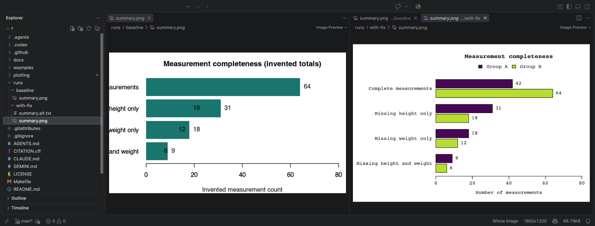

R path · [All steps](index.md) · [Change language](../python/index.md)

Lesson 4 of 6

# Check the current code and saved figure

Select **Agent** in the same **Local** Chat session. Ask it to check the latest files without making another repair:

```text
Verify only; do not edit source, tests, specifications, or alt text.
From this repository root, use the installed Rscript runtime to run
plotting/tests/run_tests.R, then plotting/check_figure.R with
--output runs/with-fix/summary.png. Run both checks even if one fails.
Show the exact commands, runtime path, exit status, and results separately.
The figure checker may regenerate the repaired PNG. Preserve the baseline.
Report any check you could not run; do not claim a visual review unless
you actually opened and inspected the image.
```

Expand the execution results in Chat. The behavior run should end with `All plotting behavior checks passed; review image readability separately.` The figure checker should report `PASS: automated JUSF figure requirements.` Both should exit successfully. The tests check program behavior; the figure checker renders the current implementation and checks journal rules. **The starter passes the first and fails the second.** The [CLI appendix](../../appendix/command-line.md#r) gives the exact terminal commands if you want to run them yourself.

## Compare the images in Explorer

In Explorer, double-click `runs/baseline/summary.png` to keep its tab open. Double-click `runs/with-fix/summary.png`, then right-click its tab → **Split Right**. Select the baseline tab in the left editor group. Keep the [journal rules](../../reference/figure-specifications.md) handy:

- Two bars per category, Group A above B; all eight values unchanged?
- Complete labels, correct legend, and no clipping or overlap?
- Required colors, monospace text, dimensions, and axes?
- Legible text and outlines at 6 × 4 inches? Groups identifiable without color?

VS Code's fit-to-window preview is useful for spotting layout problems but does not establish physical print size. Use an image viewer or document layout that supports a 6 × 4-inch display and a grayscale view. If these checks are unavailable, record them as unfinished.

[](../../../assets/images/vscode/r-plot-comparison.png)

*Actual VS Code 1.137.0 on macOS, September 11, 2026. Check the folder names above the images: baseline on the left, `with-fix` on the right. The repaired trial figure separates the groups and fits the labels. Select the image for full resolution; inspect your own outputs in the same way.*

## Read the description

Open `runs/with-fix/summary.alt.txt` in Explorer. Does it explain the comparison, all values, and the invented nature of the counts in at most 150 words? It must stand on its own without color names.

**The checker cannot approve accessibility or alt-text accuracy for you.** If anything fails, return to [the repair step](03-implement.md) with the observed problem, then rerun both checks and inspect the regenerated image. A blocked run is an unperformed check, not a pass.

**Ready for review:** you can distinguish automated results, your visual observations, and anything still unverified.

---

[← Previous: 3. Implement](03-implement.md) · [Next: 5. Review →](05-review.md)
