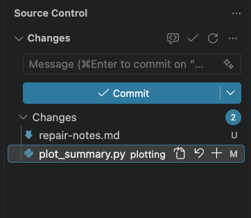
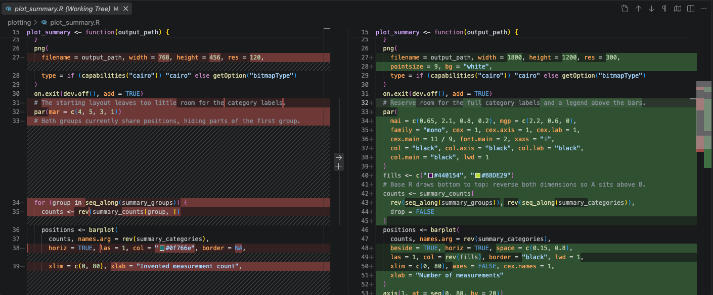

R path · [All steps](index.md) · [Change language](../python/index.md)

Lesson 5 of 6

# Read changed files and their diffs

A **diff** shows what changed between two versions of a file. Use Git's file list to review the whole repair, including files missing from Copilot's final summary.

1. Choose **File → Save All**, then open **Source Control** from the Activity Bar.
2. Look under **Changes**. `M` means modified, `U` means a new untracked file, and `D` means deleted. If **Staged Changes** is present, inspect that list too.
3. Select `plotting/plot_summary.R`. Before staging, this diff compares the original committed file with the saved repair. In a side-by-side view, original content is on the left and edited content on the right.
4. Read the changed sections. Standard themes show removals in red and additions in green, with `−` and `+` markers; color indicates a change, not whether the code is correct. A replacement can appear as both a removal and an addition.
5. For a different layout, use the diff editor's **More Actions (…) → Diff View → Side by Side** or **Inline**. Inline keeps both versions in one pane and is useful on a narrow screen. In older versions, look for **Toggle Inline View** in that menu. [VS Code diff and staging guide](https://code.visualstudio.com/docs/sourcecontrol/staging-commits)

[](../../../assets/images/vscode/source-control.png)

*Actual VS Code 1.137.0 on macOS, September 11, 2026. This Python example shows a modified file and an untracked note. The note illustrates U and is not a required exercise file; your R plotting file is `plot_summary.R`. Select the image for full resolution.*

## Connect code with the figure

[](../../../assets/images/vscode/r-diff.png)

*A repair from a disposable learner trial, shown in VS Code 1.137.0 on macOS, September 11, 2026. Original content is on the left and edited content on the right. Select the image for the full editor view. Your repair can differ; connect its changes to your own figure and check results.*

Compare the changed positions, margins, fonts, and styling with the repaired PNG. Did the counts, category order, group assignments, command interface, and dependencies stay intact? Open every other changed or new source file. Read new files in full; a new file has no earlier committed version to compare.

The plotting program should still write only the PNG. Copilot authors the alt text separately. The files under `runs/` appear in **Explorer** but stay out of **Source Control** because `.gitignore` excludes generated outputs. That is expected; review the PNG and alt text directly.

Saving an edit writes the working file. **Staging** selects saved changes for the next commit. A **commit** records that selection in local Git history. Accepting a Copilot edit or reading its change summary does not perform this Git review. [VS Code Source Control overview](https://code.visualstudio.com/docs/sourcecontrol/overview)

## Review complexity as well as correctness

A working figure can still come with code that is difficult to maintain. Review every new file, dependency, helper, class, or configuration option against the brief. This exercise calls for a plotting repair; a generalized pipeline needs a reason beyond possible future use.

Can you trace the counts to the bars and explain the changed function with Chat closed? Does each abstraction clarify this task or remove real duplication? Has the repair introduced repeated work or large intermediate objects without a need? Do not infer efficiency from passing tests, or prefer dense code just because it is shorter.

If complexity is unnecessary, ask for a simpler proposal before requesting more edits. Preserve the required validation and accessibility features, then repeat both checks and visual review after simplification. Use the [proportionality guidance](../../reference/agent-control.md#keep-the-solution-proportional-to-the-task).

## Optional second opinion

Ask a labmate, or select **Ask** in a new Local Chat session and paste:

```text
Review the R plotting diff against docs/reference/figure-specifications.md,
the checks, and the PNG and alt text in runs/with-fix/. Include changed and
new source files. Flag unnecessary complexity with locations and simpler
alternatives; preserve required validation and accessibility. Report concrete
issues and unperformed checks. Do not
edit, stage, or commit files. If you cannot access a diff or image, say so.
```

The optional [plot-review skill](../../platforms/portable-context.md) packages that review for clients that support it. Check findings against the actual files before acting on them.

**Ready for handoff:** you understand each source change you intend to keep. If review leads to another edit, repeat [verification](04-verify.md) and inspect the new diff.

---

[← Previous: 4. Verify](04-verify.md) · [Next: 6. Hand off →](06-handoff.md)
