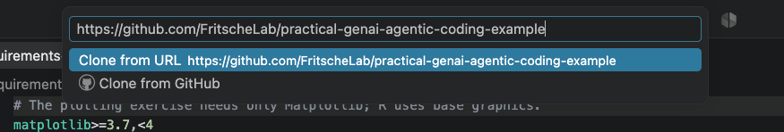
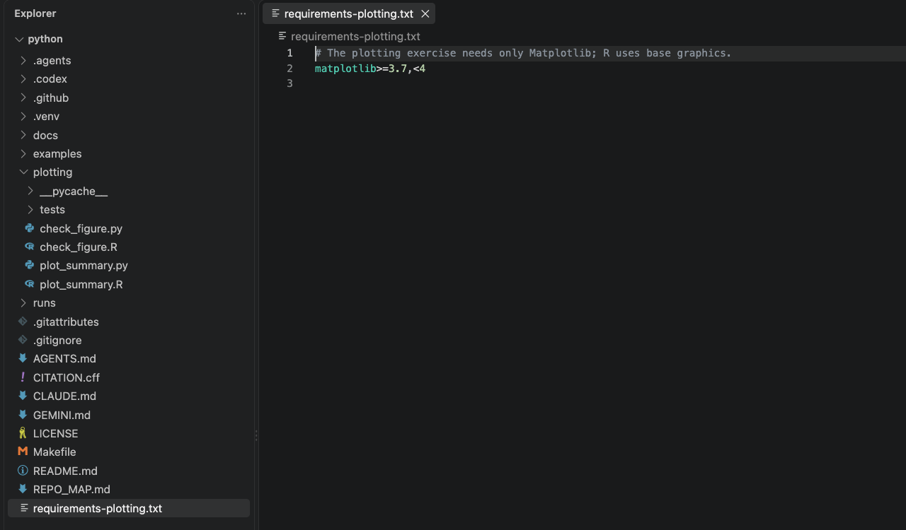
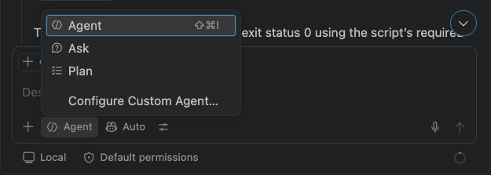
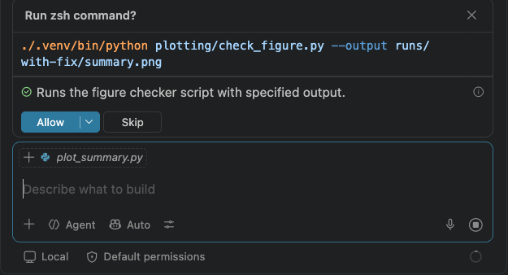
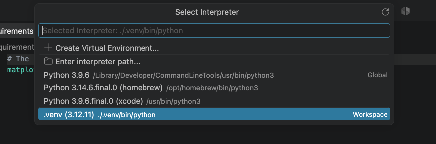
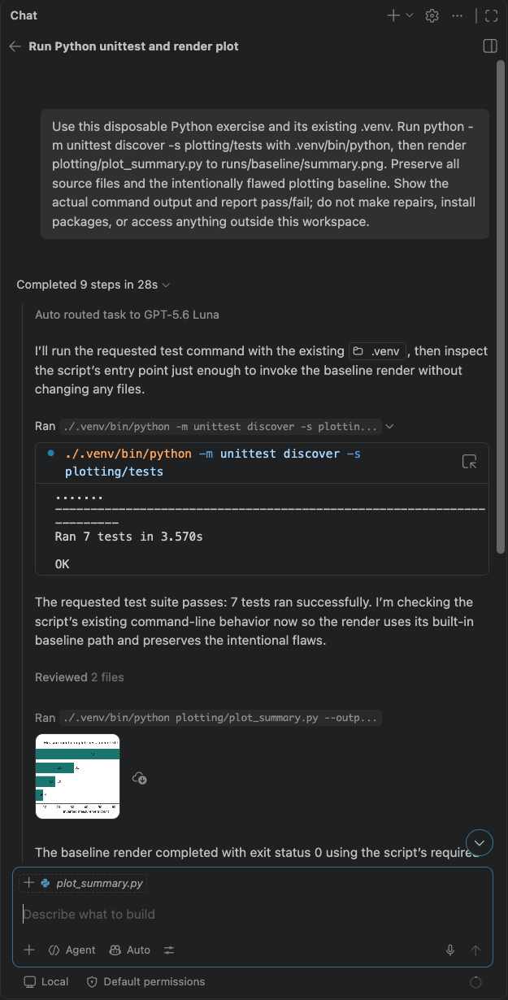

# Set up VS Code + GitHub Copilot

**Work in your editor from the first run to the final code review.** Copilot runs the Python or R commands; you read their results, open the plots, and decide which changes to keep. You do not need to type shell commands for this path.

Keep this guide open in a browser or in VS Code's Markdown preview. In VS Code, right-click a Markdown file in Explorer and choose **Open Preview**. The **Command Palette** is a searchable menu of editor actions, not a terminal: open it with **Ctrl+Shift+P** on Windows/Linux or **Cmd+Shift+P** on macOS.

Complete setup before a workshop. Choose one language and one assistant. If you already use Claude Code, follow the [short alternative below](#prefer-claude-code). If you prefer a terminal, use the [CLI appendix](../appendix/command-line.md).

This guide and exercise were developed with substantial AI assistance and are provided **as is, without warranty**, to the extent permitted by applicable law. Review the code, agent instructions, permissions, and results before use; read the [full disclosure and warranty notice](../reference/agent-control.md#about-ai-assistance-in-this-guide).

**Documentation reviewed: September 11, 2026.** UI labels can differ by VS Code version and account. This exercise uses invented aggregate counts; keep study data outside the workspace. [Lab data guidance](../reference/lab-data-policy.md).

Jump to [Windows](#windows), [macOS](#macos), [Python](#python), [R](#r), or [troubleshooting](#troubleshooting).

Screenshots show the actual exercise in **VS Code 1.137.0 on macOS 26.6.2**, captured September 11, 2026. Select an image to open it at full resolution. Account controls are hidden in these captures; Windows keyboard shortcuts are given separately.

## 1. Install the editor, Git, and your language

VS Code is the editor. Git records versions of your files. Copilot is the assistant. VS Code includes the **Source Control** interface, but it uses a separately installed Git executable. [Git prerequisites](https://code.visualstudio.com/docs/sourcecontrol/overview#prerequisites).

### Windows

1. Download the [VS Code User Installer](https://code.visualstudio.com/docs/setup/windows), run it, and open **Visual Studio Code** from Start. Use your institution's software center if installations are managed. You should see a Welcome page or an editor window.
2. Install [Git for Windows](https://git-scm.com/install/windows). Keep the installer option that makes Git available to third-party software. Close and reopen VS Code after installation so it can find Git.
3. Install only your chosen language. For Python, prefer a currently patched **Python 3.10–3.12** build maintained by your institution. [Python 3.12.10](https://www.python.org/downloads/release/python-31210/) provides Windows installers, but read the [maintenance note below](#python-installer-maintenance) before choosing that older release. For R, install **R 4.1 or later** from [CRAN for Windows](https://cran.r-project.org/bin/windows/base/). Keep R's option to save its version in the registry so editor tools can discover it.

### macOS

1. Download [VS Code for macOS](https://code.visualstudio.com/docs/setup/mac), open the download, and drag **Visual Studio Code.app** to **Applications**. Open it from Applications. Choose the build for your Mac, or the Universal build.
2. If Git is already installed, keep it. Otherwise, use your institution's software center or install Apple's **Command Line Tools for Xcode**, one of the [Git project's installation options](https://git-scm.com/install/mac). The tools' name does not mean you need to use a terminal for the lessons. Apple's installer is available through [Apple Developer Downloads](https://developer.apple.com/download/all/?q=command%20line%20tools) with Apple sign-in. Reopen VS Code afterward.
3. Install only your chosen language. For Python, prefer a currently patched **Python 3.10–3.12** build maintained by your institution. [Python 3.12.10](https://www.python.org/downloads/release/python-31210/) includes a macOS installer, but read the [maintenance note below](#python-installer-maintenance) before choosing that older release. For R, install **R 4.1 or later** from [CRAN for macOS](https://cran.r-project.org/bin/macosx/), choosing the installer for Apple silicon or Intel as appropriate.

### Linux

Install [VS Code](https://code.visualstudio.com/docs/setup/linux), Git, and your chosen supported Python or R version through your distribution or institutional software manager. The editor steps below are the same. The [CLI appendix](../appendix/command-line.md) covers terminal-based environment setup.

The language extensions do not install Python or R themselves. Python needs Matplotlib, installed into the exercise environment below. The R plotting exercise uses base R and needs no additional R packages.

### Python installer maintenance

Python 3.12.10 was the [last official 3.12 release with Windows/macOS binary installers](https://www.python.org/downloads/release/python-31211/#no-installers). Later 3.12 releases are source-only and include security fixes absent from that installer; [3.12.14](https://www.python.org/downloads/release/python-31214/) is one such release. Prefer a maintained build with current fixes within the supported range. If you cannot obtain one, ask your software support team for a supported build rather than treating 3.12.10 as the latest patched version. You do not need to compile Python to follow these lessons.

## 2. Activate Copilot and sign in

1. Use the GitHub account associated with your Copilot access. If you do not have an account, [create one](https://github.com/signup). An institutional plan, Copilot Student, Copilot Free, or another eligible Copilot plan can provide access; check the [current plan comparison](https://docs.github.com/en/copilot/get-started/plans).
2. **Students:** open [GitHub Education benefits](https://github.com/settings/education/benefits). Complete student verification if needed, then follow the benefit's activation steps for **Copilot Student**. Verification and Copilot activation are separate; the benefit can take several days to appear. If you see only a paid checkout after verification, follow [GitHub's student troubleshooting](https://docs.github.com/en/copilot/how-tos/copilot-on-github/set-up-copilot/enable-copilot/set-up-for-students).
3. In VS Code, hover over the **Copilot icon in the bottom Status Bar** and select **Use AI Features**. Follow the GitHub sign-in flow in your browser and return to VS Code. If needed, use the Command Palette action **GitHub Copilot: Sign in**. Setup installs the required extensions automatically. [Copilot setup](https://code.visualstudio.com/docs/setup/copilot), [extension setup](https://docs.github.com/en/copilot/how-tos/set-up/install-copilot-extension).
4. Open the Copilot status dashboard from the Status Bar and check that the expected account/plan is active. This is also where you can monitor usage. No separate model API key is needed for this Copilot path.

**Use Auto when available.** Current GitHub documentation lists Auto model selection for Copilot Free and Student. Other plans can offer a choice of models; that list depends on access and policy. The model control chooses who generates the response, while Ask/Plan/Agent chooses how the assistant works. Model comparison is optional for this exercise. Every plan has usage limits; consult the [current allowances](https://docs.github.com/en/copilot/get-started/plans) instead of assuming unlimited chat.

## 3. Clone and open the exercise

A **clone** is a local copy with Git history. Its existing commit gives you the starting point for the colored code comparison later.

1. Open **Source Control** from the branching icon in the left Activity Bar. Choose **Clone Repository**. If another project is open, use the Command Palette action **Git: Clone**.
2. Paste this repository address into the clone input:

   `https://github.com/FritscheLab/practical-genai-agentic-coding-example.git`

   [](../../assets/images/vscode/clone-repository.png)

   *Confirm the repository address in the clone input before continuing. The optional `.git` suffix identifies the same repository.*

3. Select a parent folder such as Documents or a course folder. VS Code creates the exercise folder inside it. When cloning finishes, select **Open**.
4. If Workspace Trust appears, review the repository and trust this exercise folder when you are ready to allow its code and tools to run. [Workspace Trust](https://code.visualstudio.com/docs/editing/workspaces/workspace-trust).
5. Select **Explorer**, the file icon in the Activity Bar. Confirm you see **README.md**, **plotting**, **docs**, and **requirements-plotting.txt** at the top level. Open **README.md**. Then check **Source Control**: there should be no changes yet.

[](../../assets/images/vscode/workspace.png)

*The opened exercise, with `plotting` expanded. This disposable copy is named `python`; a normal clone uses the repository name. The `.venv` and `runs` folders shown here appear after Python setup in Step 5.*

If you already cloned the example, choose **File → Open Folder** and open that folder. A downloaded ZIP has no Git history; clone a fresh copy for this walkthrough so the starting commit and diffs are ready. [VS Code cloning walkthrough](https://code.visualstudio.com/docs/sourcecontrol/quickstart).

Use a separate clone if you want to complete both languages. Both paths use the same output names, so a second path in the same folder could overwrite the first path's plots.

## 4. Find the Chat controls

Choose **Chat → Open Chat** in the title bar. The conversation opens beside your editor. Start a new chat and inspect the controls near its input box. [Chat view](https://code.visualstudio.com/docs/agents/run/chat-view).

| Control | Choose for this walkthrough | What it means |
| --- | --- | --- |
| Session Target | **Local** | Use the current workspace and VS Code's tools. Local names this session type; model requests still use your configured service. |
| Agent/role picker | **Agent** for setup; then **Ask → Plan → Agent** in Lessons 1–3 | Ask explains; Plan researches and proposes work; Agent can edit files and run commands. |
| Language model | **Auto**, if available | Let your plan's routing select a model. Choosing a named model is optional. |
| Permissions | **Manual permissions** (called **Default permissions** in the captured client) | Inspect execution requests that require your approval. Saved tool and terminal approvals can still apply. Some other versions show Default Approvals. |

The **Local** target supplies Ask, Plan, and Agent in the role picker. Other targets have different options; use this target to follow the illustrations and lessons. Planning, model selection, and permission controls are separate. [Session targets and roles](https://code.visualstudio.com/docs/agents/run/agent-harnesses), [permissions](https://code.visualstudio.com/docs/agents/run/approvals).

[](../../assets/images/vscode/copilot-modes-focused.png)

*The open menu selects the role. Auto is the model choice; Local is the session target. This captured version labels its default approval control Default permissions.*

Open `.github/copilot-instructions.md` in Explorer. It points to **AGENTS.md** and **REPO_MAP.md**, which tell the assistant how this exercise works. Use those existing instructions; there is no need to generate new project instructions.

### Before the first approval

Repeated requests can turn **Allow** into a habit. Check the action's purpose, affected files or destinations, possible consequences, and whether approval also covers future actions. If you cannot explain it, choose **Skip** and request an explanation or a narrower action. Keep Manual/Default permissions; do not enable unrestricted approvals to silence prompts.

Read [permissions, sandboxing, and independent work](../reference/agent-control.md) for concrete examples and sandbox controls. A Local session, `.venv`, Git, or a planning instruction does not provide a sandbox. Keep practising explanation and debugging without Chat so you can maintain your work if AI access becomes unavailable or prohibited.

## 5. Prepare your language and save the starting chart

Select **Agent** for this setup step because it needs to run commands. The prompts below allow environment setup and running the starter, but explicitly leave the plotting repair for the lessons. Read a requested command and its purpose before approving it. You may see a terminal panel open: Copilot types the commands; you inspect the output.

[](../../assets/images/vscode/agent-execution-focused.png)

*An actual execution request. Read the command and output location before choosing Allow. This later verification request checks a repaired figure in `runs/with-fix/`; your first setup prompt runs the behavior tests and saves the baseline.*

### Python

1. Open **Extensions** in the Activity Bar. Search for **Python**, select the extension published by **Microsoft**, and choose **Install** if needed. Open `plotting/plot_summary.py` in Explorer.
2. Paste this into Copilot Chat:

```text
I'm setting up the Python plotting exercise. Read AGENTS.md and REPO_MAP.md.
Identify this repository root and an installed Python 3.10–3.12 interpreter.
Create or reuse this repository's .venv using that supported interpreter,
and install requirements-plotting.txt there. Use the .venv interpreter
explicitly for every Python command; report its path and Python version.
Run the existing plotting behavior tests and render runs/baseline/summary.png.
If that baseline already exists, preserve it and ask me for a new output path.
Do not repair the chart or change tracked source, tests, specifications,
requirements, or Git state. Overlap and clipped labels are intentional.
Report actual commands, results, and the output path. If setup or checks
fail, stop and explain the blocker instead of changing the exercise.
```

3. Review installation/execution requests and wait for the reported results. Expand the command result in Chat to read its output. The behavior tests should finish successfully; the chart should be written to the requested path.
4. Open the Command Palette and choose **Python: Select Interpreter**. Select the interpreter inside this folder's **.venv**. If discovery has not refreshed, use **Enter interpreter path…** to select `.venv/Scripts/python.exe` on Windows or `.venv/bin/python` on macOS/Linux. Open a Python file and check its interpreter in the Status Bar. Match it to the executable Copilot reported; editor selection alone does not prove which executable a shell command used. [Python environment selection](https://code.visualstudio.com/docs/python/environments).

[](../../assets/images/vscode/python-interpreter.png)

*Select the workspace `.venv`, with a supported Python version. The other entries are separate installed interpreters; your list will differ. On Windows the environment executable ends in `Scripts/python.exe`.*

### R

1. Open `plotting/plot_summary.R` in Explorer. You can use the exercise with base R and Copilot. The optional **R** extension by **REditorSupport** adds editor features; its language server and interactive plot-viewer packages are optional additions to this exercise. We open saved PNG files directly. [R editor features](https://code.visualstudio.com/docs/languages/r).
2. Paste this into Copilot Chat:

```text
I'm setting up the R plotting exercise. Read AGENTS.md and REPO_MAP.md.
Identify this repository root and the installed Rscript executable.
Report its path and R version; the exercise requires R 4.1 or later.
Run the existing R plotting behavior tests and render
runs/baseline/summary.png using that executable. No R packages are needed.
If that baseline already exists, preserve it and ask me for a new output path.
Do not repair the chart or change tracked source, tests, specifications,
dependencies, or Git state. Overlap and clipped labels are intentional.
Report actual commands, results, and the output path. If Rscript isn't found
or a check fails, stop and explain the blocker instead of changing the exercise.
```

3. Review execution requests and expand the command results. Confirm the summary says the R plotting tests passed. Some checks intentionally exercise errors; evaluate the final test result, not an isolated expected error message.

### Open the baseline

In Explorer, expand **runs → baseline** and open **summary.png**. A **baseline** is the result before your changes. Here its bars overlap and long labels are clipped: that is the starting assignment.

Now open **Source Control** again. It should still have no tracked source changes. The environment, caches, and `runs/` are ignored by Git, so the image belongs in Explorer but will not appear in the changed-file list.

**Passing behavior tests does not mean the chart is readable.** A separate journal figure checker should reject this unfinished starter. Later, a successful repair must pass both checks and your visual review. Do not ask the setup agent to repair the starter just because it notices the chart's flaws.

[](../../assets/images/vscode/agent-check-results.png)

*Expand a command result to read what ran. Here the seven Python behavior tests pass, while the saved chart still has the exercise's deliberate flaws. Your own results, including failures, are the evidence to record.*

## 6. Continue with your language

Keep the baseline PNG available and select **Ask** for Lesson 1:

- [Continue with Python](../paths/python/01-orient.md).
- [Continue with R](../paths/r/01-orient.md).

In Lesson 2 you will select **Plan**, review the proposed repair, and hand it to **Agent** in Lesson 3. The final lessons show how to open the colored diff, stage reviewed source files, and make a local commit.

## Prefer Claude Code?

Use the **Claude Code extension for VS Code** with the same cloned exercise. Install **Claude Code** by **Anthropic** from Extensions, open it with the Spark icon or **Claude Code: Open in New Tab** in the Command Palette, and complete its sign-in flow. The extension includes the CLI it needs; a separate terminal installation is unnecessary. Access uses your Claude subscription, Console account, or configured institutional provider, separately from Copilot. [Claude Code extension setup](https://code.claude.com/docs/en/vs-code).

Paste the same language-specific prompts into Claude's panel. Use its **Manual** permission mode for setup and execution, then **Plan** for the explanation and repair plan. Review the plan and choose the acceptance option for **manually approving edits** so implementation starts in **Manual** mode. Accepting a plan starts implementation; select manual approval at that decision, before editing begins. The mode indicator is at the bottom of Claude's prompt box. In Manual, review proposed edits and command requests. These are Claude's controls; the Copilot Ask/Plan/Agent selector belongs to Copilot Chat. [Claude plan approval](https://code.claude.com/docs/en/permission-modes#review-and-approve-a-plan).

Explorer, saved PNGs, Source Control's changed-file list, colored diffs, staging, and local commits work the same way. Open **CLAUDE.md**, which points to this exercise's shared instructions. Continue with your chosen language's six lessons, applying this mode translation. Further options are in the [Claude Code reference](../platforms/claude-code.md).

## Troubleshooting

| What you see | What to do next |
| --- | --- |
| Source Control says Git is missing | Finish the Git installation, close all VS Code windows, and reopen the exercise. On a managed machine, use your software center or support team. |
| Explorer shows the wrong project or an outer folder | Use File → Open Folder and select the cloned folder that directly contains README.md and plotting/. |
| Python is missing or outside 3.10–3.12 | Install a supported version, reopen VS Code, and ask Copilot to repeat environment setup with that version. Do not change the exercise's requirements to bypass the problem. |
| A module is missing after setup | Compare Copilot's executable with the selected .venv interpreter. Ask it to use that executable to check the existing requirements installation and report the first error. |
| Windows cannot find Rscript | In File Explorer, locate R's installation under Program Files → R → your version → bin and find Rscript.exe. Give Copilot that exact path and ask it to use the quoted full path. A space in Program Files is normal. |
| Rscript is missing on macOS/Linux | Check that R is installed and reopen VS Code. Ask Copilot to locate the installed executable and report its path before running the exercise. |
| Chat requests sign-in or shows the wrong plan | Check the Copilot account in the Status Bar. Student verification may need a separate activation step. Follow the account steps above. |
| Ask or Plan is absent | Start a new Chat and choose the Local session target. Check your VS Code updates and account/organization settings if the controls are still missing. |
| A package download or command is blocked | Read the first error and the permission request. Resolve the installation, approved network access, or execution permission before rerunning; no successful check has occurred yet. |
| The allowance is exhausted | Check the Copilot status dashboard. Resume when access is available or use the CLI appendix to run and review manually. Changing a model does not guarantee additional allowance. |
| The PNG already exists | Keep it. Choose a new output folder in your next Chat request and use that path consistently in later comparisons. |
| Source Control shows source edits immediately after setup | Open each diff and establish why it changed before proceeding. Setup should create outputs and an environment, leaving the starter source intact. |

For a terminal workflow or exact commands to compare with Copilot's output, use the [CLI appendix](../appendix/command-line.md).
