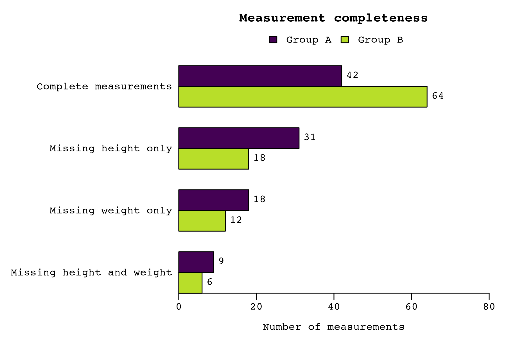

<section class="guide-hero" aria-labelledby="guide-title">
  
Practical GenAI · Part 2

  <h1 id="guide-title">Build research code you can explain.</h1>
  
Work through a small project with a coding agent, learn how to check its work, and leave the next person a project they can pick up.

  

    <a class="btn btn-primary" href="{{ '/docs/paths/python/' | relative_url }}">Start with Python →</a>
    <a class="btn btn-primary" href="{{ '/docs/paths/r/' | relative_url }}">Start with R →</a>
  

  
A Fritsche Lab teaching guide · University of Michigan

</section>

  
<strong>Two language paths</strong>Choose Python or R for the same plotting exercise.

  
<strong>Your choice of agent</strong>Use a supported coding tool with the same goals and checks.

  
<strong>Understand what changed</strong>Work out the answer, inspect the changes, and check the result.

## Pick up where Part 1 leaves off

[Part 1](https://fritschelab.org/practical-genai-coding-guide/) introduced planning, prompting, and reviewing code. Here you put those habits to work on a plot with overlapping bars and clipped labels.

Download the [example repository](https://github.com/FritscheLab/practical-genai-agentic-coding-example), choose Python or R, and follow six lessons online or offline. Repair the plot without changing its values, check the agent's work, and leave a result a labmate can rerun.

Your target: a readable chart for the fictional **Journal of Unnecessarily Specific Figures (JUSF)**. The [exercise](docs/lessons/02-specify.md) shows the problem; its local [figure specifications](docs/reference/figure-specifications.md) give the rules.

Make accessibility part of every figure: readable labels, sufficient contrast, groups identifiable without color, and reviewed alternative text.

If you are new to using GenAI for coding, begin with Part 1. If you can already run a script and inspect a change, [start here]({{ '/docs/quickstart.html' | relative_url }}).

<section class="guide-section" aria-labelledby="learning-heading">
  

    
A practical learning path

    <h2 id="learning-heading">From the first run to a reviewed change</h2>
    
Keep the project small so you can see the whole workflow.

  

  <ol class="guide-learning-path">
    <li>01
<h3>Establish a working baseline</h3>
Choose Python or R, run its tests, and open the baseline plot before asking an agent to edit anything.
<a href="{{ '/docs/quickstart.html' | relative_url }}">Run the quickstart →</a>
</li>
    <li>02
<h3>Make the repository understandable</h3>
Use a README, agent instructions, a repository map, and data contracts to make expectations explicit.
<a href="{{ '/docs/practices/' | relative_url }}">Explore repository practices →</a>
</li>
    <li>03
<h3>Choose one small improvement</h3>
Describe the change and how you will check it. Review its plan and the files it changes.
<a href="{{ '/docs/lessons/' | relative_url }}">Work through the lessons →</a>
</li>
    <li>04
<h3>Leave a useful result</h3>
Run the checks, compare the plots, and leave enough detail for a labmate to rerun the work.
<a href="{{ '/docs/reference/' | relative_url }}">Read the exercise reference →</a>
</li>
  </ol>
</section>

<section class="guide-section" aria-labelledby="resources-heading">
  

    
Make it useful in your own work

    <h2 id="resources-heading">Choose what you need next</h2>
  

  

    
<h3>Set up your agent</h3>
Prepare a coding tool to work with the example repository.
<a href="{{ '/docs/platforms/' | relative_url }}">Agent setup →</a>

    
<h3>Reuse the templates</h3>
Write a task brief, agree on the data, or hand off unfinished work.
<a href="{{ '/docs/templates/' | relative_url }}">Browse templates →</a>

    
<h3>Teach a lab session</h3>
Use the 45-minute runbook and a focused live exercise.
<a href="{{ '/docs/lab_meeting/' | relative_url }}">Teaching materials →</a>

  

</section>

<aside class="guide-note" aria-labelledby="demo-heading">
  <h2 id="demo-heading">A teaching project you can inspect</h2>
  
The counts are invented and embedded in code. The agent works with source, tests, and images; no participant records are needed.

  
<a href="https://github.com/FritscheLab/practical-genai-agentic-coding-example">Get the exercise on GitHub</a>.

</aside>
